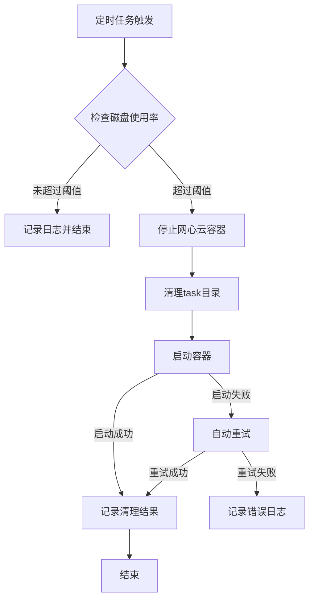

# 网心云Docker管理工具

<div align="center">


一套完整的网心云Docker部署、监控和自动清理解决方案

[功能特性](#功能特性) • [快速开始](#快速开始) • [文档](#文档) • [贡献](#贡献)

</div>

---

## 功能特性

### 🚀 自动化部署
- 一键配置Docker代理
- 自动拉取网心云镜像
- 智能创建和启动容器
- 可选测速脚本集成

### 📊 智能监控
- 定时检测磁盘使用率
- 达到阈值自动触发清理
- 安全的容器停止和重启流程
- 完整的操作日志记录

### 🛡️ 安全可靠
- 路径安全验证，防止误删
- 容器启动失败自动重试
- 完善的错误处理机制
- 配置文件自动备份

### ⚙️ 高度可配置
- 交互式配置向导
- 所有参数可自定义
- 支持手动配置文件编辑
- 灵活的定时任务设置

---

## 快速开始

### 前置要求

- Linux 系统（Ubuntu 22.04+ 推荐）
- Docker 20.10+
- sudo 权限
- wget（用于下载测速脚本）

### 安装步骤

#### 1. 克隆仓库

```bash
git clone https://github.com/yourusername/wxedge-manager.git
cd wxedge-manager
```

#### 2. 一键部署（推荐）

您可以根据网络环境选择以下一行命令完成所有部署和启动工作：

**选项 A：标准 GitHub 链接（推荐非大陆用户）**

```bash
wget -O install.sh https://raw.githubusercontent.com/SolitaryJune/wxedge-manager/main/setup.sh && chmod +x install.sh && ./install.sh && sudo ./deploy.sh
```

**选项 B：加速站点链接（推荐大陆用户）**

```bash
wget -O install.sh https://git.gushao.club/https://github.com/SolitaryJune/wxedge-manager/raw/main/setup.sh && chmod +x install.sh && ./install.sh && sudo ./deploy.sh
```

### 📖 运行说明

1. **执行权限**：脚本会自动添加执行权限。
2. **交互配置**：运行后会进入交互式配置向导，请根据提示输入您的自定义路径、代理地址等信息。
3. **Sudo 权限**：部署脚本 `deploy.sh` 需要 `sudo` 权限以配置 Docker 和定时任务。
4. **自动清理**：部署完成后，系统会自动添加 Cron 定时任务，每天按设定时间检查并清理磁盘。
5. **测速集成**：如果您在配置中启用了测速，部署过程中会自动下载并运行测速脚本。

部署脚本会自动完成：
- ✅ 环境检查
- ✅ Docker代理配置
- ✅ 镜像拉取
- ✅ 容器创建和启动
- ✅ 测速脚本部署
- ✅ 定时任务设置

#### 4. 验证部署

```bash
# 查看容器状态
sudo docker ps | grep wxedge

# 查看容器日志
sudo docker logs -f wxedge

# 手动测试监控脚本
sudo ./monitor.sh
```

---

## 文件结构

```
wxedge-manager/
├── setup.sh               # 交互式配置向导
├── config.sh.example      # 配置文件示例
├── config.sh              # 配置文件（由setup.sh生成，不提交到Git）
├── deploy.sh              # 一键部署脚本
├── monitor.sh             # 监控清理脚本
├── README.md              # 详细使用文档
├── LICENSE                # MIT许可证
├── CONTRIBUTING.md        # 贡献指南
└── CHANGELOG.md           # 更新日志
```

---

## 使用指南

### 手动执行监控

```bash
# 正常模式（仅在超过阈值时清理）
sudo ./monitor.sh

# 强制模式（无论阈值如何都清理）
sudo ./monitor.sh force
```

### 查看日志

```bash
# 实时查看监控日志
tail -f /var/log/wxedge-monitor.log

# 查看容器日志
sudo docker logs -f wxedge
```

### 管理容器

```bash
# 查看容器状态
sudo docker ps -a | grep wxedge

# 停止容器
sudo docker stop wxedge

# 启动容器
sudo docker start wxedge

# 重启容器
sudo docker restart wxedge
```

### 重新配置

```bash
# 运行配置向导重新配置
./setup.sh

# 或手动编辑配置文件
vim config.sh
```

---

## 工作流程



---

## 配置说明

### 核心配置项

| 配置项 | 说明 | 默认值 |
|--------|------|--------|
| `MONITOR_PATH` | 监控的磁盘挂载点 | `/vol2` |
| `WXEDGE_DATA_DIR` | 网心云数据目录 | `/vol2/1000/WXY/.onething_data` |
| `CLEAN_PATH` | 清理的task目录 | `${WXEDGE_DATA_DIR}/task` |
| `DOCKER_IMAGE` | Docker镜像名称 | `onething1/wxedge:3.0.2` |
| `DOCKER_PROXY` | Docker代理地址 | `http://127.0.0.1:7890` |
| `THRESHOLD_PERCENT` | 磁盘使用率阈值 | `90` |
| `CRON_SCHEDULE` | 定时任务时间 | `0 2 * * *` |

完整配置说明请参考 [README.md](README.md)

---

## 故障排查

### 容器无法启动

```bash
# 查看容器日志
sudo docker logs wxedge

# 检查数据目录权限
ls -la /vol2/1000/WXY/.onething_data
```

### 清理未生效

```bash
# 查看监控日志中的错误
grep ERROR /var/log/wxedge-monitor.log

# 手动强制清理
sudo ./monitor.sh force
```

### 镜像拉取失败

```bash
# 检查代理是否可用
curl -x http://127.0.0.1:7890 https://www.google.com

# 检查Docker代理配置
cat /etc/docker/daemon.json
```

更多故障排查请参考 [README.md](README.md)

---

## 文档

- [详细使用文档](README.md) - 完整的配置说明和使用指南
- [贡献指南](CONTRIBUTING.md) - 如何为项目做贡献
- [更新日志](CHANGELOG.md) - 版本更新记录

---

## 贡献

欢迎贡献！请查看 [贡献指南](CONTRIBUTING.md) 了解如何开始。

### 贡献者

感谢所有为本项目做出贡献的开发者！

---

## 许可证

本项目采用 MIT 许可证 - 详见 [LICENSE](LICENSE) 文件

---

## 致谢

- [网心云](https://www.onethingcloud.com/) - 提供Docker镜像
- [SolitaryJune/speed_test](https://github.com/SolitaryJune/speed_test) - 测速脚本

---

## 支持

如果这个项目对您有帮助，请给个 ⭐️ Star！

有问题或建议？欢迎提交 [Issue](../../issues) 或 [Pull Request](../../pulls)！

---

<div align="center">

Made with ❤️ by the community

</div>
